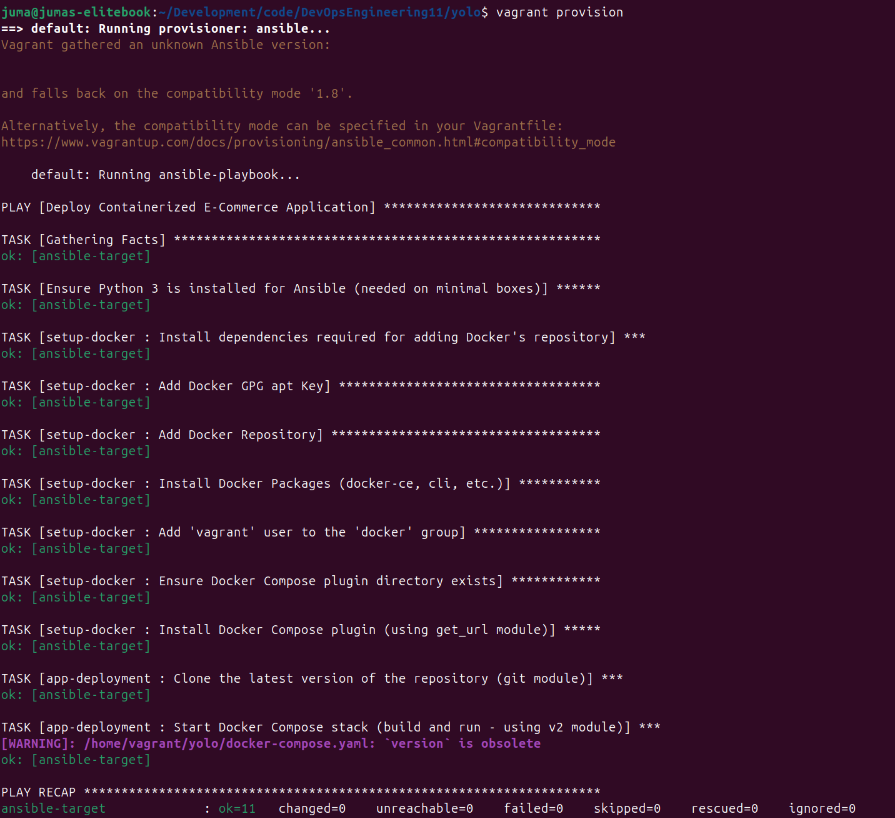

# Automated Container Deployment with Vagrant and Ansible

Welcome to the **DevOps deployment repository**.  
This project demonstrates how to provision a virtual machine (VM) using **Vagrant** and deploy a **multi-container Docker application** using an **Ansible playbook**.

---

## Table Of Contents

- [Prerequisites](#prerequisites)
- [Project Overview](#project-overview)
- [Getting Started](#getting-started)
- [Accessing the Application](#accessing-the-application)
- [Troubleshooting](#troubleshooting)
- [Management Commands](#management-commands)

---

## Prerequisites

Before deploying the stack, ensure you have the following installed on your host machine

- **VirtualBox**: The virtualization software (used by Vagrant)  
- **Vagrant**: The tool for managing and provisioning VMs  
- **Ansible**: The automation engine (used by Vagrant for provisioning)  
- **Git**: For cloning this repository  
- **Virtualization Enabled (VT-x/VTx)**: This must be enabled in your computer's BIOS/UEFI settings  

---

## Project Overview

The deployment process follows these steps:

1. **Vagrant Setup:**  
   Creates a VirtualBox VM using the `geerlingguy/ubuntu2004` box.

2. **Host-Only Networking:**  
   Configures a private network for the VM to be accessible from the host machine.

3. **Ansible Provisioning:**  
   - **Role 1 (setup-docker):** Installs Docker Engine and Docker Compose V2 plugin.  
   - **Role 2 (app-deployment):** Clones the application code from the specified Git repository and uses `docker_compose_v2` to build and launch the application containers.

---

## Getting Started

Clone this repository:

```bash
git clone git@github.com:Jjumaaa/yolo.git - Using a password-protected SSH key.
                    OR
git clone https://github.com/Jjumaaa/yolo.git - Clone using the web URL.
cd yolo
Start and provision the VM:
This command will boot the VM and execute the Ansible playbook for deployment.
(This step includes the time-consuming Docker image build process.)

```bash
vagrant up --provision
If the VM is already running, you can re-run the deployment using:

```bash
vagrant provision

Expected Output:


# Accessing the Application
Once the vagrant provision command completes successfully (failed=0 in the PLAY RECAP), your application is running.

Identify VM IP: The default Host-Only IP configured in the Vagrantfile is usually 192.168.56.10.

Open Browser: Access the deployed e-commerce application in your host browser:

http://192.168.56.10

#Troubleshooting
The following issues and fixes were noted during deployment:

VT-x Error: Ensure Virtualization Technology (VT-x/VTx) is enabled in your BIOS.

Hypervisor Conflict (KVM): If encountering VERR_VMX_IN_VMX_ROOT_MODE, ensure KVM or other hypervisors are disabled/unloaded before running Vagrant.

Docker Install Error: The setup-docker role was updated to correctly add the official Docker repository keys and sources.

Ansible Syntax Errors: The app-deployment role was corrected to use supported docker_compose_v2 parameters (project_src, build: always).

#Management Commands
To control the VM after deployment:

vagrant ssh	Connect to the VM's command line.
vagrant suspend	Pause the VM and save its state (fastest to resume).
vagrant halt	Gracefully shut down the VM.
vagrant status	Check the current state of the VM.
vagrant destroy -f	Permanently delete the VM and all associated data.

```

## Expected output when you Run vagrant up --provision or vagrant provision:
